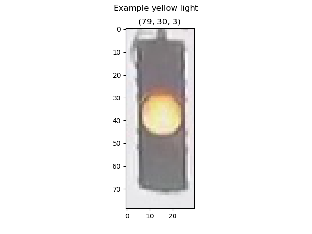
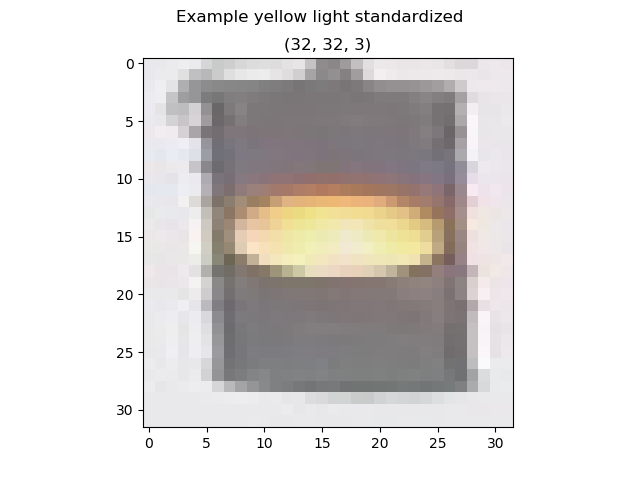
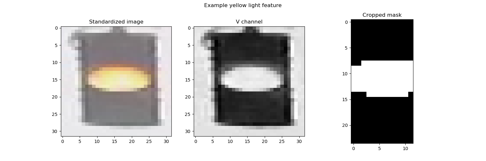
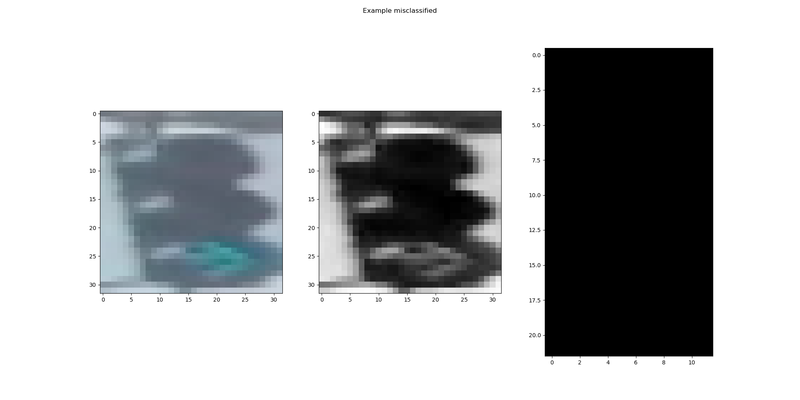

# **Traffic Light Classifier**
## Udacity Intro to Self-Driving Cars Nanodegree Project

This project uses computer vision techniques to classify a set of traffic light images as being either red, yellow or green.

The rules for this project are as follows:
* Accuracy must be greater than 90%
* Must not classify any red lights as green

The pipeline consists of the following steps:

### 1. Load an image
First we load one of the images like in this example.

### 2. Standardize images
All the test images need to be standardized to make it easier to process them all the same. For example we can resize them all to a fixed height and width.

### 3. Feature extraction
Next we'll have to decide on a feature to extract that will help our model determine the color of the light. I used a simple feature which is the location of the brightest pixels relative to the whole image. I take a standardized picture, convert it to HSV color space and extract the V channel. Crop it to remove as much of the background as possible and whichever pixels are higher than a certain threshold I made white and the rest made black. Finally I check to see where most of the white pixels fall in the image. If they are in the top third then it is red, middle is yellow and bottom is green.

### 4. Classification and visualizing error
Finally we run the algorithm on all the images and calculate its accuracy. Any misclassified images need to be studied to help improve our algorithm. In this example it appears our algorithm was not able to pick up any pixels that were bright enough.

## To Run:
* Clone project
* If you have conda you can load my environment by running `conda env create -f environment.yml`
* I use the same environment for all my Udacity Self-Driving Car course python projects
* Run `python main.py`
